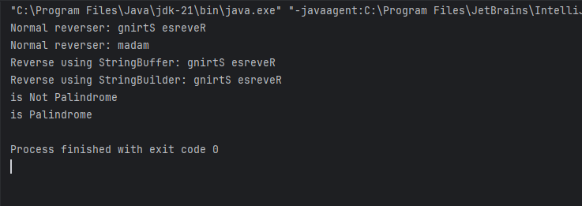

# Java-Reverse-String-with-Palindrome-Check
Program in java to Reverse String in 3 different way and check if string is palindrome or not

1. Normal Way
2. Using StringBuffer
3. Using String Builder
4. Check Palindrome

Output:

